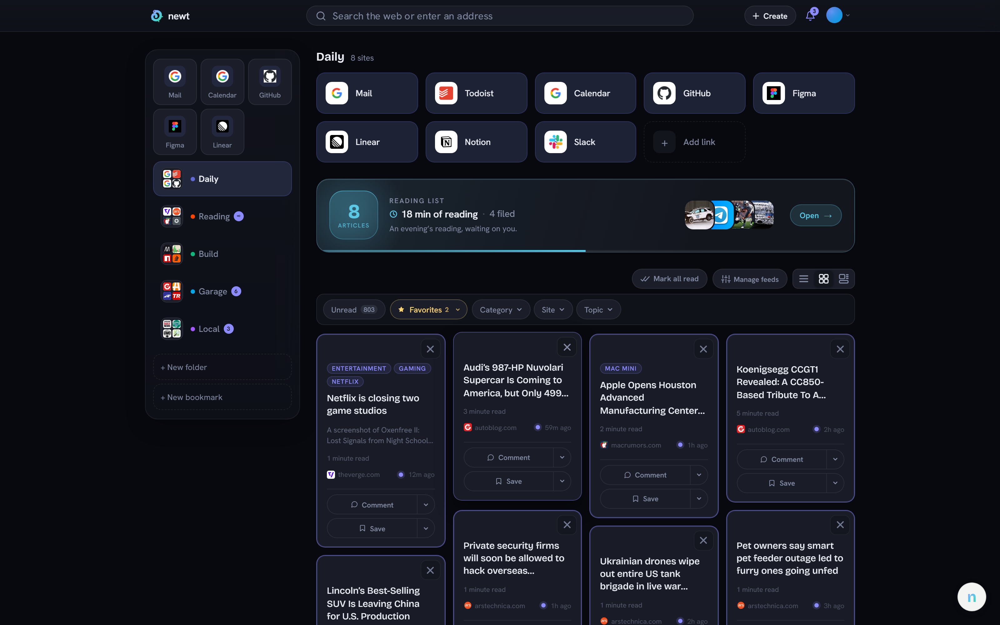
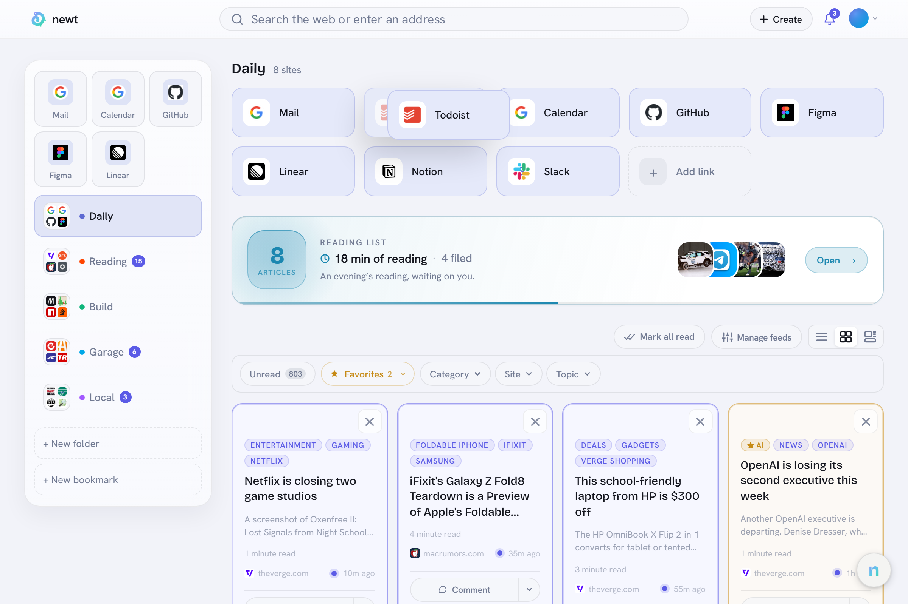
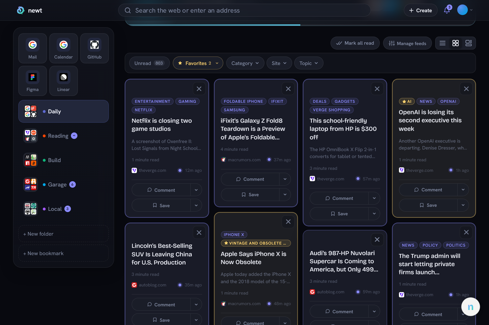
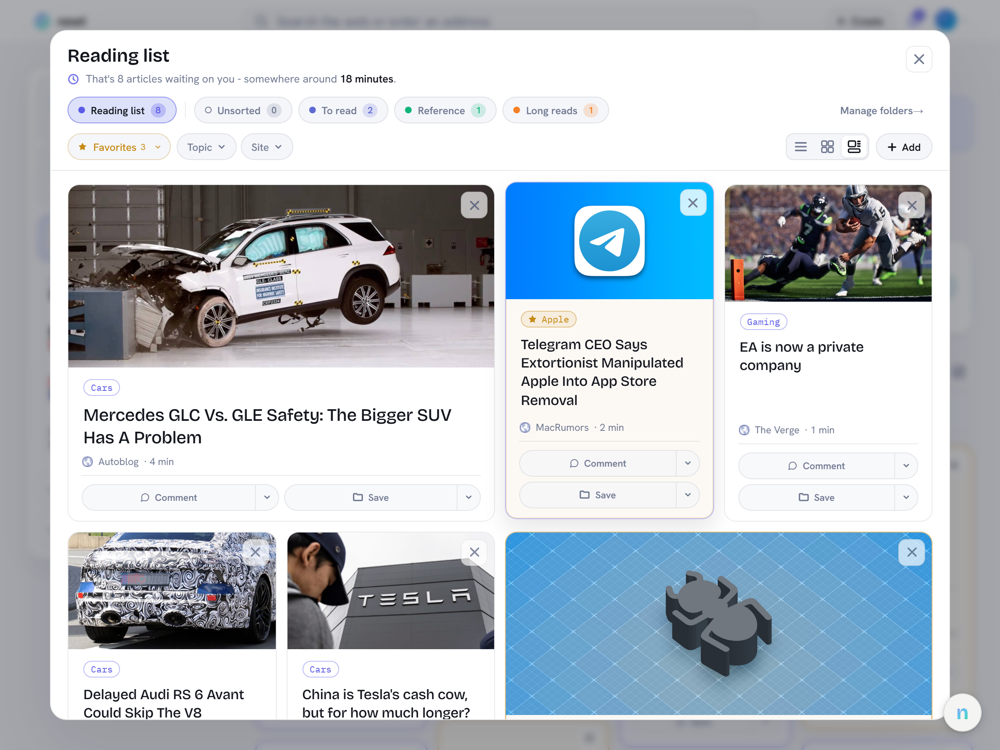
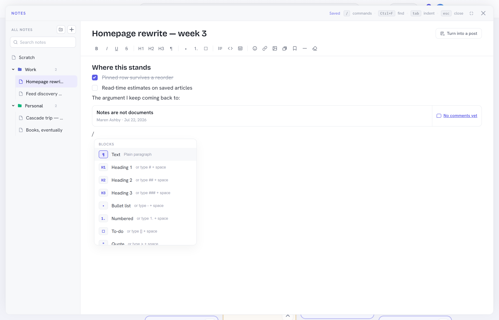
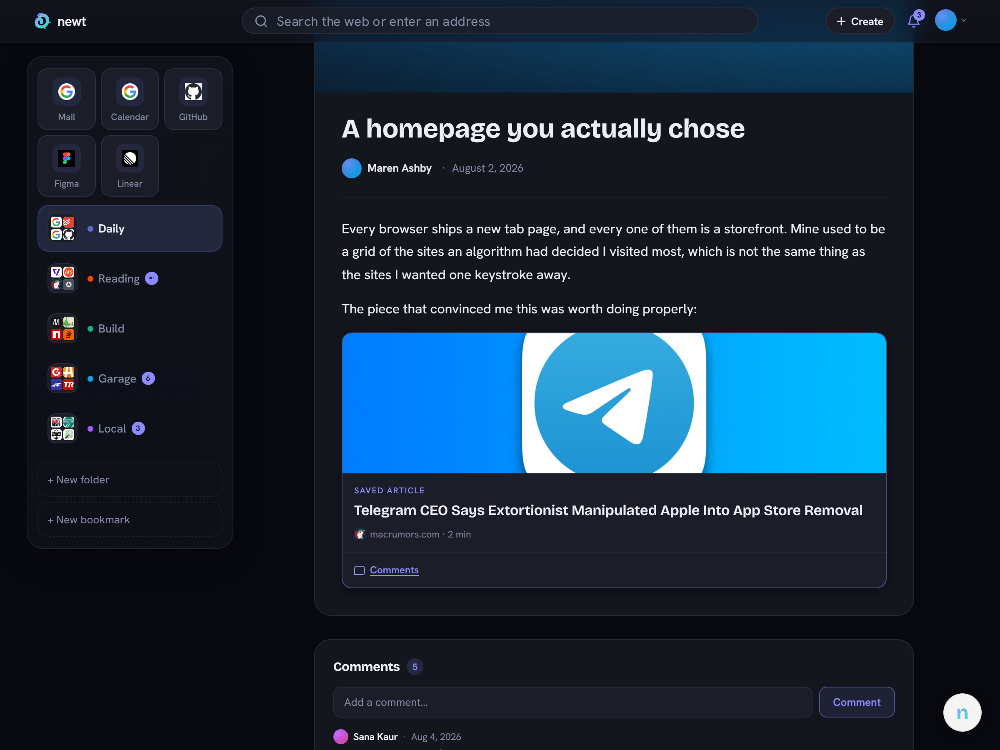
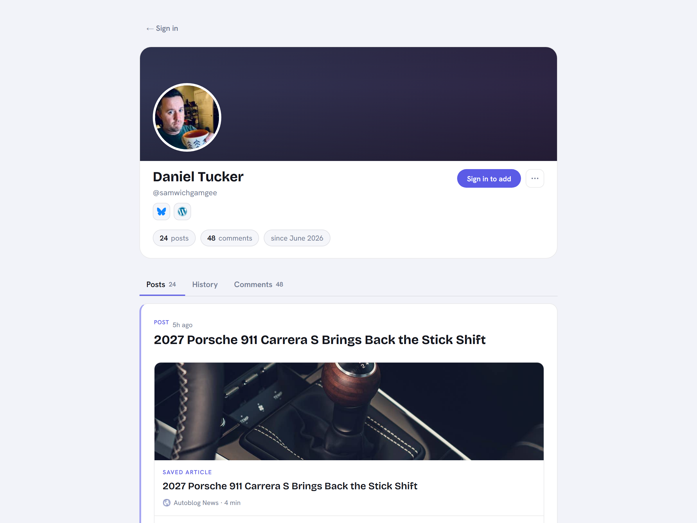

# newt

A browser new tab replacement that turns your new tab page into a personal
productivity dashboard. Bookmarks, one combined RSS river, a reading list,
notes, a blog of your own, and an AI that reads what you read.

**Just want to use it? [newt.page](https://newt.page) is the hosted version.
Sign up and point your new tab at it, nothing to install.** The rest of this
README is for running your own instance.

     



## Features

### Bookmarks

Colour-coded folders with drag-and-drop reordering, pinned tiles across the top
of the sidebar, and two layouts (a right-side panel, or folders that expand in
place). Import from an HTML bookmark file exported by any browser. Paste a plain
address and Newt derives the name, the colour and the favicon; type `http://` in
front and it keeps it, which is what makes a bookmark for a NAS or a router on
your own network work.



### Feeds

One combined river of everything you follow, newest first, never ranked. Paste a
site address and Newt finds its feed; YouTube channels, Reddit, GitHub, Bluesky
and Mastodon resolve too. Group feeds into your own categories and filter by
category, site or topic. Bookmarked sites are checked for a feed and offered,
never subscribed behind your back.

Duplicates are folded, so one story that reaches you through two subscriptions
is one card. Nothing is inserted into the page while you are reading it: new
arrivals show up as a pill you can take or ignore.



### Reading list and Library

Save articles with tags, notes and an estimated read time. Finished pieces go to
the Library, which is organised with shelves of your own. Folders contain, tags
describe, and the two are deliberately separate systems.



### Explore, Proofread and /ask (bring your own model)

Newt can use an AI model, and the model is yours. Paste your own API key into
Settings → AI, and the provider bills you. There is no shared key and no
operator account behind it. Until you connect one, none of these features appear
in the interface at all.

- **Explore** at `/explore` is a saved thread, not a chat window. Ask a
  question, keep asking, come back to it next week. Any article or post has an
  Explore button that opens a thread with that piece as context.
- **The article is actually read.** Most feeds publish a two-sentence teaser, so
  Newt fetches the article's own page when the stored copy is too thin, caches
  the text and shares it between readers. When a paywall or a consent wall
  blocks it, the model is told it only has a summary rather than left to write
  confidently about something it never saw.
- **Your own feed is searchable by the model.** Your model has a training
  cutoff, which makes it weakest exactly where you are most curious. Asking
  about something current searches the articles already in your database, scoped
  to your own subscriptions, and cites them as ordinary links. Nothing is
  fetched for this.
- **Proofread** in the composer reports and does not rewrite. Each finding is a
  quote from your draft, a reason and a suggestion; you make the change.
- **`/ask your question`** from the search bar opens it in Explore instead of
  sending you to a search engine.
- **Condense into a post** turns a thread that got somewhere into a private
  draft.

Three providers work: **Claude**, **ChatGPT**, and anything speaking the OpenAI
format at a URL you supply, which covers Ollama, OpenWebUI, LM Studio, vLLM,
OpenRouter and the rest. Answer length (Brief, Balanced, Thorough) sets how hard
the model thinks as well as how much it writes, because thinking is billed as
output.

One constraint people hit: **a self-hosted endpoint has to be reachable from the
internet.** A LAN address like `192.168.1.50:11434` or `localhost` is refused.
Newt accepts sign-ups, and a server that fetches any URL an account gives it is
a server that maps the network it sits in on that account's behalf. Publish the
box through a tunnel or a reverse proxy with TLS and it works.

### Notes

A notes console with folders, rich text, slash commands, references to your own
saved articles, and a recently deleted shelf. The tree is versioned, so a tab
you left open all morning cannot post its stale copy over a day of writing.



### Posting and profiles

Write posts with a rich editor that handles image galleries, tags and drafts.
Your posts go out as their own RSS feed, so other people can follow you the same
way they follow anything else. Profiles have followers, friends, comment threads
with nesting, and a public post list at `/u/<name>`.



A profile is a public page. This one is live at
[newt.page/u/samwichgamgee](https://newt.page/u/samwichgamgee):



### The rest

- **Site pages.** Click a site name on any card for `/s/<domain>`: everything
  that publisher has put in your feed, everything you have saved from it, and
  where it sits in your folders and categories.
- **Favourite tags.** Star a tag to have matching articles flagged in the feed
  and reading list. Matching is by whole word, so "Apple" catches "Apple News"
  and "apple-tv" but not "Snapple".
- **Search.** A quick search bar over Google, DuckDuckGo, Bing or Brave that
  also searches your own bookmarks, saved articles and notes.
- **Safety.** Blocking is a mutual wall rather than a mute, plus reporting,
  and an admin review queue behind both.
- **Notifications.** An in-app bell for replies, follows and friend requests.
  There is no SMTP anywhere in this server.
- **Admin panel.** Feed health, a searchable list of every feed on the instance,
  a refresh log, error log and user administration.
- **Themes.** Dark, light and auto. The screenshots above mix the two, which is
  the quickest way to see that neither is an afterthought.
- **2FA.** TOTP with QR enrolment.
- **Console.** Backtick (`` ` ``) toggles a command palette: `ip`, `dns`,
  `speedtest`, `theme`, `folder`, `add`, `version`, and `ping` / `tracert` for
  admins.

## Tech Stack

| Layer | Technology |
|---|---|
| Frontend | React 18, TypeScript, Vite, CSS Modules |
| Backend | Node.js 20, Express 4, TypeScript |
| Database | PostgreSQL 17 via Prisma 7 |
| Auth | JWT (access plus refresh token rotation), bcryptjs, TOTP |
| AI | Per-user API keys, sealed with AES-256-GCM. Anthropic, OpenAI, or any OpenAI-compatible endpoint |
| Deployment | Docker Compose, nginx |

## Getting Started

### Prerequisites

- [Docker](https://www.docker.com/) and Docker Compose (recommended)
- Or: Node.js 20+ and PostgreSQL 17

### 1. Clone and configure

```bash
git clone https://github.com/danieltucker/newt.git
cd newt
cp .env.example .env
```

Edit `.env` and fill in the required values:

```env
# Strong random password for PostgreSQL
POSTGRES_PASSWORD=changeme

# Generate each with:
#   node -e "console.log(require('crypto').randomBytes(32).toString('hex'))"
JWT_ACCESS_SECRET=replace-with-random-64-char-hex
JWT_REFRESH_SECRET=replace-with-different-random-64-char-hex

# Encrypts the AI keys users connect, and their TOTP secrets. Generate with:
#   node -e "console.log(require('crypto').randomBytes(32).toString('base64'))"
LLM_KEY_SECRET=replace-with-random-base64-32-bytes

# URL users access the app at. Must match exactly for CORS.
CLIENT_ORIGIN=http://localhost

# Port to expose the web UI on
APP_PORT=80

# Use false for plain HTTP (local), true when behind an HTTPS proxy
COOKIE_SECURE=false

# Set to false once you have created your account(s)
REGISTRATION_ENABLED=true
```

The server refuses to start in production without the three secrets. Back all
three up with your database. `LLM_KEY_SECRET` in particular is worth knowing
about before you touch it: rotating it makes every stored AI key undecryptable
*and* locks every 2FA-enrolled user out until an admin clears their enrolment.

Two more worth knowing, both in `.env.example`:

- `TRUST_PROXY` is the number of proxy hops in front of the server, so per-IP
  rate limiting sees the real client. Leave it unset for `npm run dev`, set `1`
  for the local Docker stack, `2` behind your own reverse proxy.
- `CONSOLE_ENABLED=false` turns off the `ping` and `tracert` endpoints entirely.

### 2. Run with Docker

```bash
docker compose up --build
```

This starts three services: PostgreSQL, the Express API, and the nginx-served
React frontend. Open `http://localhost` (or your configured `APP_PORT`).

### 3. Create your account

Register on first launch. Once done, set `REGISTRATION_ENABLED=false` in `.env`
and restart to close sign-ups.

```bash
npm run make-admin --workspace=server -- <username>
```

gives that account the admin panel.

## Development

```bash
npm install
npm run dev
```

- Frontend: `http://localhost:5173`
- Backend: `http://localhost:3001`

### Database scripts

All of these are server-workspace scripts:

```bash
npm run db:deploy   --workspace=server   # apply pending migrations (use this one)
npm run db:generate --workspace=server   # regenerate the Prisma client
npm run db:studio   --workspace=server   # Prisma Studio at localhost:5555
```

`db:migrate` (`prisma migrate dev`) exists but will offer to reset the database
on this schema, because an early migration was edited after it ran and its
checksum no longer matches. Write the migration SQL by hand under
`server/prisma/migrations/<YYYYMMDDHHMMSS>_<name>/` and apply it with
`db:deploy`, which never offers a reset. `prisma migrate status` is safe to run
at any time.

### Tests

```bash
npm test                          # client and server
npm run test --workspace=client
npm run test --workspace=server
```

### Screenshots

The images in this README and on the marketing pages are generated, not
hand-captured, from seeded fictional accounts:

```bash
npm run seed-showcase --workspace=server   # build the accounts and their content
npm run shots                              # capture all of them, dark theme
npm run shots -- --light                   # the same set in light, as <id>-light.png
npm run shots -- feeds notes               # or just the ones you need
npm run marketing:check                    # confirm the pages render them
```

They land in `client/public/shots/`. One of them, `profile`, is taken against
the live site signed out, so it needs neither the dev server nor the database.
See the README in that folder for the per-shot notes.

## Project Structure

```
newt/
├── client/                 # React frontend (Vite)
│   ├── public/shots/       # Generated screenshots
│   └── src/
│       ├── components/     # UI components
│       ├── pages/          # AuthPage, NewTabPage, SitePage, ResearchPage (Explore)...
│       ├── hooks/          # useAuth, useFolders, useBookmarks, useSettings...
│       ├── marketing/      # Landing and feature page copy
│       ├── services/       # API service layer
│       └── utils/          # Shared pure helpers, unit tested
│
├── server/                 # Express backend
│   ├── src/
│   │   ├── routes/         # auth, folders, feeds, bookmarks, blogs, llm, research...
│   │   ├── middleware/     # Auth guards, error handler
│   │   └── lib/            # Feeds, LLM adapters, SSRF gate, logger, DB client
│   ├── prisma/
│   │   ├── schema.prisma
│   │   └── migrations/
│   ├── scripts/            # make-admin, showcase and persona seeds
│   └── Dockerfile
│
├── scripts/                # shots.mjs, marketing and HTML checks
├── docker-compose.yml
├── .env.example
└── package.json            # npm workspaces root
```

## Security Notes

- JWT access tokens are short-lived (15 min). Refresh tokens live in httpOnly
  cookies and are stored **hashed**, so a database dump does not hand over live
  sessions.
- TOTP secrets and AI API keys are stored **encrypted** (AES-256-GCM under
  `LLM_KEY_SECRET`), because both have to be read back. Passwords are bcrypt at
  cost 12.
- **Every user-supplied URL the server fetches goes through one SSRF gate**:
  feed discovery, feed polling, favicons, article text and self-hosted AI
  endpoints. Redirects are followed by hand so each hop is re-checked against
  the address that passed, rather than trusting the fetch library.
- Auth endpoints are rate-limited to 20 requests per 15 minutes per IP. Writes
  are additionally metered per account, so rotating IPs does not buy more.
- Set `COOKIE_SECURE=true` and serve over HTTPS in production, and set
  `TRUST_PROXY` to match your setup or per-IP limiting sees only the proxy.
- Disable registration (`REGISTRATION_ENABLED=false`) after setup on
  public-facing deployments.

## License

MIT
